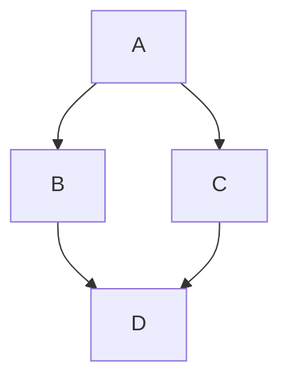
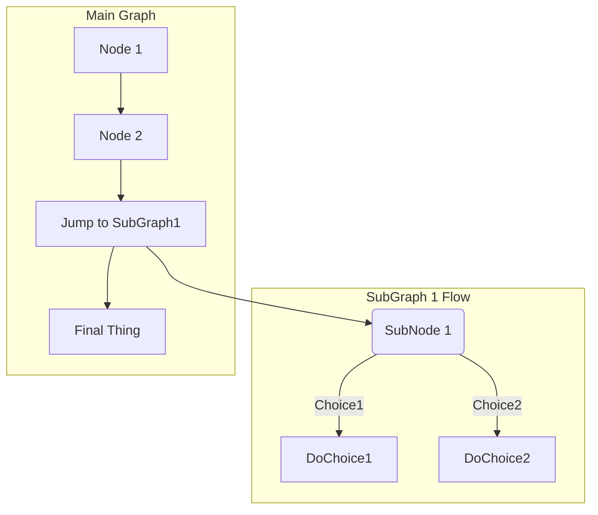
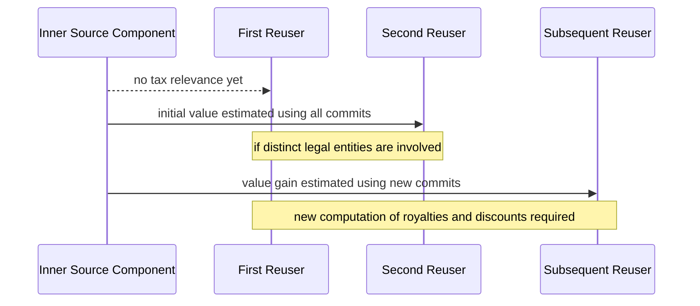
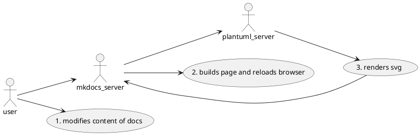
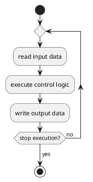
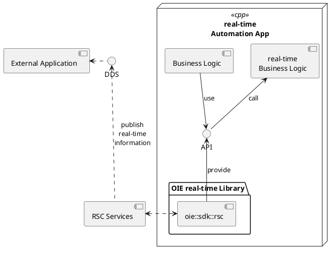
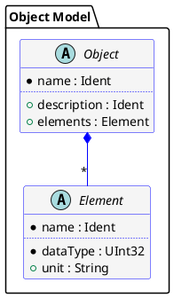

# Nunc eget lorem

Nunc eget lorem dolor sed viverra ipsum nunc aliquet bibendum. Egestas integer eget aliquet nibh
praesent tristique magna sit. Hac habitasse platea dictumst quisque sagittis purus sit amet.

Etiam non quam lacus suspendisse faucibus interdum posuere lorem. Imperdiet sed euismod nisi
porta lorem mollis aliquam. Nunc sed augue lacus viverra vitae congue eu.
Amet nisl suscipit adipiscing bibendum est ultricies integer quis auctor. Eget arcu dictum
varius duis at consectetur lorem donec. Amet luctus venenatis lectus magna fringilla.

Aliquet nec ullamcorper sit amet risus nullam eget felis. Odio pellentesque diam volutpat
commodo sed egestas egestas fringilla phasellus. Eget velit aliquet sagittis id
consectetur purus. Nunc sed augue lacus viverra vitae congue eu consequat.

## Non curabitur gravida arcu

Nunc sed augue lacus viverra vitae congue:

```sh
# Tellus mauris a diam maecenas sed enim ut sem viverra.
pip maecenas --viverra poetry
```

Sit amet commodo nulla facilisi nullam vehicula ipsum:

```sh
poetry maecenas --viverra --no-root
```

Arcu cursus euismod quis viverra nibh. .

Habitasse platea dictumst vestibulum rhoncus est pellentesque.



Ut enim ad minim veniam, quis nostrud exercitation ullamco laboris
nisi ut aliquip ex ea commodo consequat. Duis aute irure dolor in
reprehenderit in voluptate velit esse cillum dolore eu fugiat nulla
pariatur. Excepteur sint occaecat cupidatat non proident, sunt in
culpa qui officia deserunt mollit anim id est laborum.



### Sequence diagram



## PlantUML

```plantuml

Alice -> "Bob()" : Hello
"Bob()" -> "This is very\nlong" as Long
' You can also declare:
' "Bob()" -> Long as "This is very\nlong"
Long --> "Bob()" : ok

```

While loop


```plantuml
title While Loop - Activity Diagram

start

while (Hungry?)  is (Yes)
:Eat Hot Wings;
:Drink Homebrew;
endwhile (No)
:Go To Sleep;
stop
```

Sequence Diagram

```plantuml
title "Messages - Sequence Diagram"

actor User
boundary "Web GUI" as GUI
control "Shopping Cart" as SC
entity Widget
database Widgets

User -> GUI : To boundary
GUI -> SC : To control
SC -> Widget : To entity
Widget -> Widgets : To database
```

C4PlantUML

```c4plantuml
!include C4_Context.puml

LAYOUT_WITH_LEGEND()

title System Context diagram for Internet Banking System

Person(customer, "Personal Banking Customer", "A customer of the bank, with personal bank accounts.")
System(banking_system, "Internet Banking System", "Allows customers to view information about their bank accounts, and make payments.")

System_Ext(mail_system, "E-mail system", "The internal Microsoft Exchange e-mail system.")
System_Ext(mainframe, "Mainframe Banking System", "Stores all of the core banking information about customers, accounts, transactions, etc.")

Rel(customer, banking_system, "Uses")
Rel_Back(customer, mail_system, "Sends e-mails to")
Rel_Neighbor(banking_system, mail_system, "Sends e-mails", "SMTP")
Rel(banking_system, mainframe, "Uses")

```

With paths



Polygons



More polygons:



With Model Attributes:


