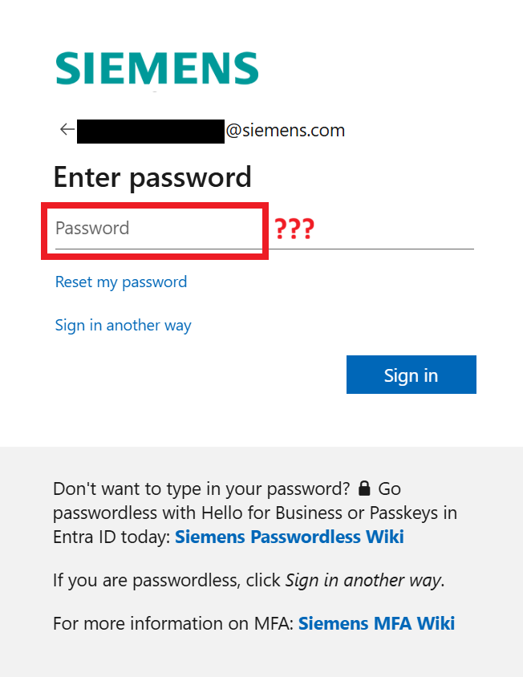
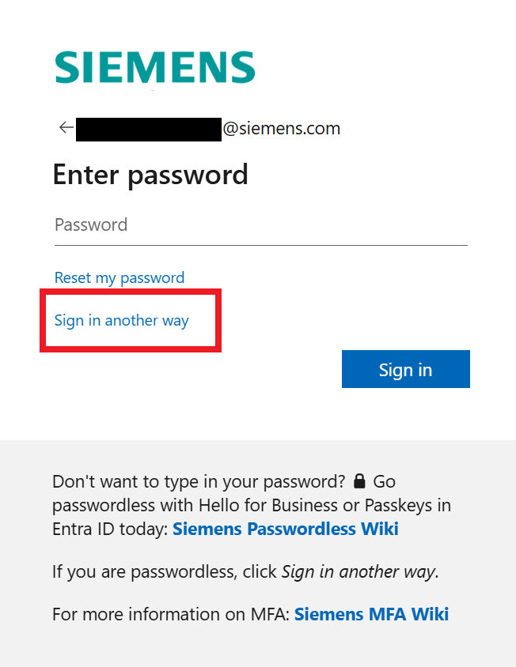
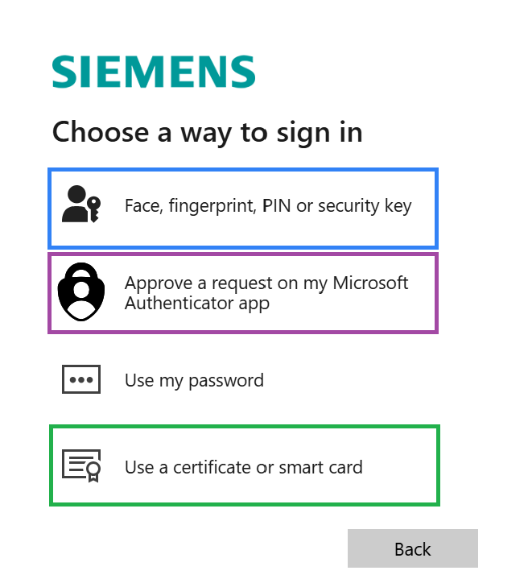

# How to reset my Siemens account password?

/// admonition | Please don't call the MyIT help desk
    type: warning

Avoid calling or submitting a ticket to the MyIT help desk if you've forgotten your password, as they are unable to assist and doing so will incur significant costs for Siemens.
///

There are two ways for resetting your password, one via self-service (recommended) and one which needs to be done by your manager or two colleagues.

/// admonition | Setup passwordless after your password reset (recommended)
    type: tip

After resetting your password, in order to avoid forgetting or using your password in the future, please [setup passwordless as described here (requires authentication)](https://www.siemens.com/passwordless).
///

## Self-service password reset process (recommended)

If you're reading this, there's a good chance you've forgotten your Microsoft Account password.

The best way to proceed, which works in most cases, is to click on `Sign in another way`. If you have Windows Hello for Business on your Windows device, a Siemens Smartcard (company badge) with PKI/certifcates on it, a Passkey on your smartphone, or a MacOS client, you will be able to sign in without a password.

This will bring you to this page where you can select passwordless methods to authenticate:

- Select `Face, fingerprint, PIN or security key` if you have:
  - Windows Hello for Business on your managed Windows device
  - Hello for Mac (automatically rolled out on all managed macOS devices)
  - A passkey on your smartphone
  - A physical passkey / FIDO2 security key (e.g. YubiKey)

- Select `Approve a request on my Microsoft Authenticator app` if you have set up passwordless sign-in in your `Microsoft Authenticator` mobile app.

- Select `Use a certificate or smart card` if you have a company badge / smart card with a golden chip and valid PKI certificates on it. Please note: Virtual Smart Card (VSC) is not supported.

If you are sucessfully able to sign-in, then [request a new password in MyIT (requires authentication)](https://myit.siemens.com/myitportal?id=sc_cat_item&table=sc_cat_item&sys_id=29738742c3025ad423c3dc4c0501311c). The necessary steps are documented in [this manual (requires authentication)](https://manuals.siemens.com/useit/manual/useit/en/how-to-reset-your-user-account-password-via-myit).

/// admonition | Done
    type: success

You should now be able get a new password.
///

## Assisted password reset procesess

### The Manager driven password reset process

In the rare case the self-service isn't working, please reach out to your manager directly (or super-requester if your unit has implemented this concept). The manager (or super-requester) must open MyIT and select the menu item `Act on Behalf of`.

In the following dialog your manager (or super-requester) must select you by clicking on your name.

If successful, the manager (or super-requester) should see the MyIT landing page with a banner informing them about a successful impersonation.

/// admonition | Done
    type: success 

Now the manager can follow [this manual (requires authentication)](https://manuals.siemens.com/useit/manual/useit/en/how-to-reset-your-user-account-password-via-myit) to reset your password.
///

/// admonition | Ssetup passwordless (recommended)
    type: tip

In order to avoid forgetting or using your password in the future, please [setup passwordless as described here (requires authentication)](https://www.siemens.com/passwordless).
///

### The Emergency password reset process

If the manager can't be reached there is an emergency process that can be performed by typically two colleagues in your department. This process is documented in this [this manual (requires authentication)](https://manuals.siemens.com/useit/manual/agm/en/emergency-password-reset).

/// admonition | Setup passwordless (recommended)
    type: tip

In order to avoid forgetting or using your password in the future, please [setup passwordless as described here (requires authentication)](https://www.siemens.com/passwordless).
///

/// admonition | Please don't call the MyIT help desk
    type: warning

Avoid calling or submitting a ticket to the MyIT help desk if you've forgotten your password, as they are unable to assist and doing so will incur significant costs for Siemens.
///
