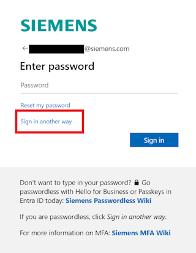

/// warning | Please don't call the MyIT help desk
Avoid calling or submitting a ticket to the MyIT help desk if you've forgotten your password, as they are unable to assist and doing so will incur significant costs for Siemens.
///

/// tip | Setup passwordless after your password reset
To avoid forgetting your password or using it in the future, please [setup passwordless (requires authentication)](https://www.siemens.com/passwordless).
///

# How to reset my Siemens account password?

Did you forget your Siemens account password?

Start with the recommended self-service process below!

## Self-service password reset process

### Step 1. Try to authenticate using another available sign-in method

On the Microsoft sign-in screen, select `Sign in another way`.

{width=320px}

Available alternative sign-in methods:

- `Face, fingerprint, PIN or security key`
If you have one of the following: Windows Hello for Business, Hello for Mac,a passkey on your smartphone or a physical passkey / FIDO2 security key (e.g. YubiKey)

- `Microsoft Authenticator app`
If you have set up passwordless sign-in in your `Microsoft Authenticator` mobile app.

- `Certificate or Smart Card`
If you have a company badge / smart card with a golden chip and valid PKI certificates on it. Please note: *Virtual Smart Card (VSC) is not supported.*

### Step 2: Were you able to authenticate?

=== "Yes"

    Great! Authentication was successful. You can now [reset your password via myIT](https://myit.siemens.com/myitportal?id=sc_cat_item&table=sc_cat_item&sys_id=29738742c3025ad423c3dc4c0501311c).

    Or follow these steps:

    1. Go to the [myIT Portal](https://www.siemens.com/myIT).
    1. Click on `My Services`.
    1. Under `Services & Products`, select your Corporate Microsoft account.
    1. Click on `Manage Service` on the left menu.
    1. Select the `Reset Account Password` option.
    1. Confirm that your account is pre-filled in the first field.
    1. Select the mailbox where you want the new password to be sent.
    1. Click Order Now.

    /// tip | Please note
    To avoid forgetting your password or using it in the future, please [setup passwordless (requires authentication)](https://www.siemens.com/passwordless).
    ///

=== "No"

    Unable to authenticate using any available method? Contact your manager (or an myIT Expert Requester if your unit has implemented this concept) for support. Your manager (or myIT Expert Requester) can start the password reset process as described below on your behalf.

## Assisted password reset processes

Use the following options only when self-service authentication is not possible.

### The Manager driven password reset process

Contact your manager (or an myIT Expert Requester if your unit has implemented this concept). They can open the myIT portal, select the `Act on Behalf of` option to impersonate you, and order the password reset (here) on your behalf.

/// tip
Ask the myIT Digital Assistant for guidance! Your manager can ask the myIT chatbot: **"How do I act on behalf of an employee in myIT?"**
///

### The Emergency password reset process

If your manager (or an myIT Expert Requestor) cannot be reached, two *internal* colleagues in your department can perform the emergency process.

#### Pre-requisites

- Only internal employees can perform an emergency password reset.
- You can only reset passwords for people in your part of the organization, such as your department.

#### Roles involved

- Requester: the person who needs a password reset.
- Initiator: the person responsible for starting the reset process.
- Approver: the person who approves the reset request (only if the requester has no mobile phone number or personal email address stored in the SCD).

#### Step-by-step guidance (requester prespective)

1. **Contact an authorized colleague:** Ask your manager, direct report, or a colleague from your department to initiate the password reset using this link.
1. **Verify your identity:** Once the process has been initiated, you will be contacted and asked to confirm your identity.
1. **Receive both halves of your password:**
    - **If your alternative contact details are stored in SCD,** the first half is sent to the initiator and the second half is sent to you via your registered email or mobile number.
    - **If no alternative contact details are available,** the first half is sent to the initiator and the second half to an approver selected by the initiator.
1. **Obtain both halves securely:** The initiator (and the approver, if applicable) will share their password half with you via a secure method (e.g. phone call, in person).
1. **Sign in and change your password:** Once you have both halves, sign in with the temporary password. You will be prompted to create a new password during your first login.

/// tip | Please note
To avoid forgetting your password or using it in the future, please [setup passwordless (requires authentication)](https://www.siemens.com/passwordless).
///

/// warning | Please don't call the MyIT help desk
Avoid calling or submitting a ticket to the MyIT help desk if you've forgotten your password, as they are unable to assist and doing so will incur significant costs for Siemens.
///
