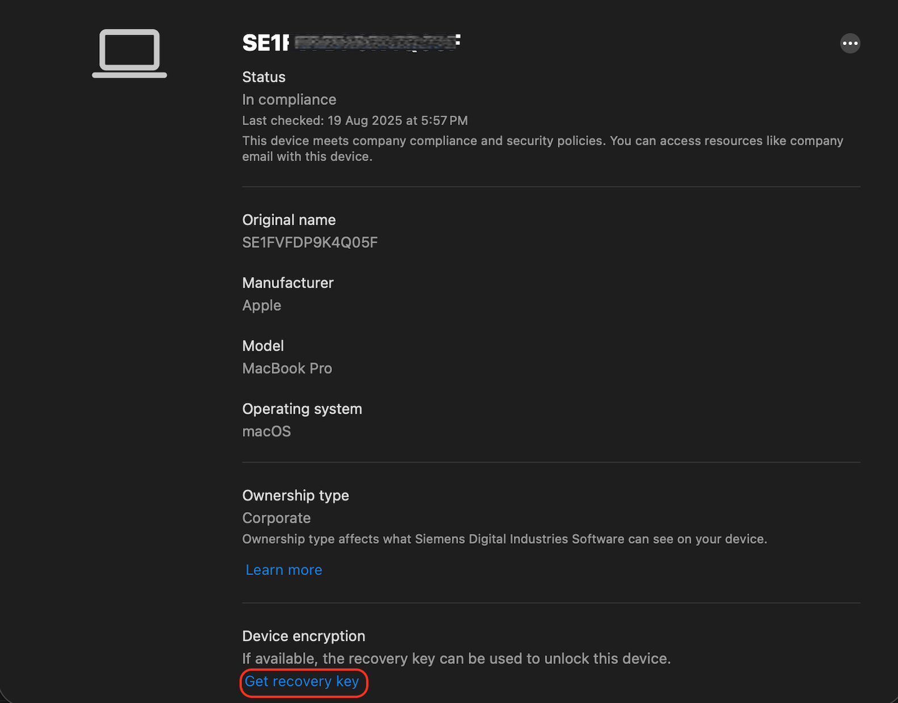
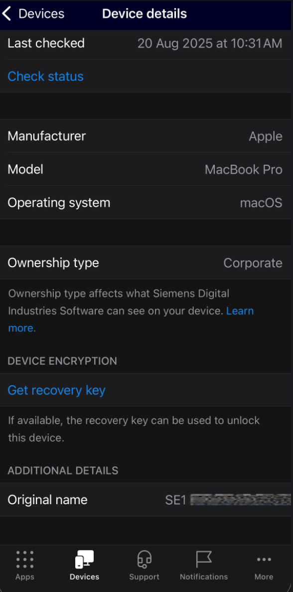
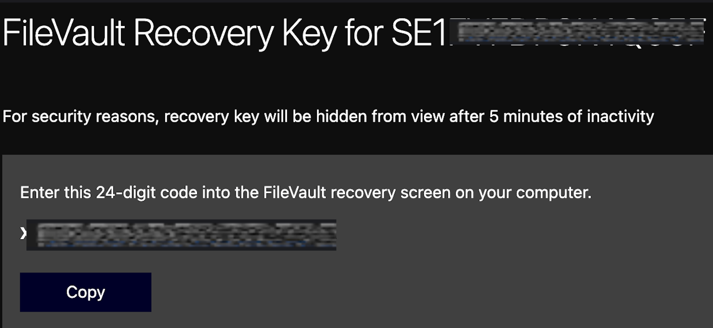
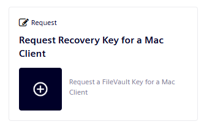
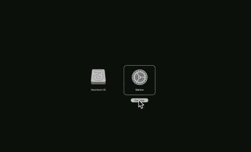
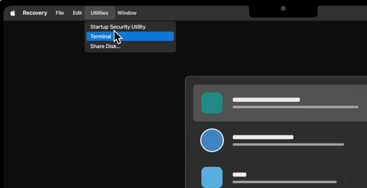
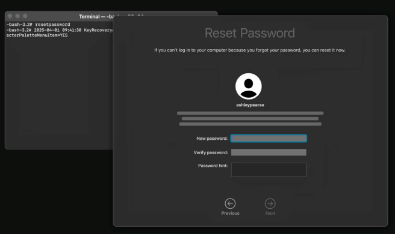
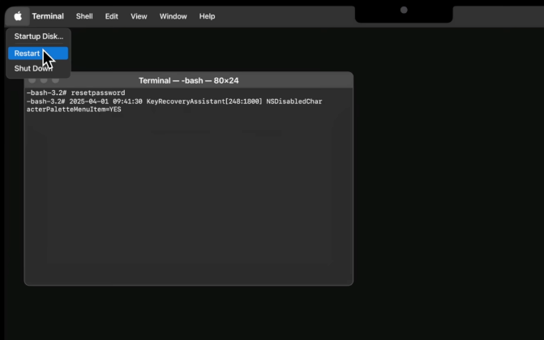

# Mac account blocked? Unable to log in?

/// warning | Please don't call the MyIT help desk
Avoid calling or submitting a ticket to the MyIT help desk if you've forgotten your password, as they are unable to assist and doing so will incur significant costs for Siemens.
///

If your Mac account is blocked and you need access to your recovery key, choose one of the options below and follow the instructions.

## 1. Company Portal

Use this option for managed devices.

### From your Mac

1. Log in to **Company Portal**.
2. Scroll down and select **Get Recovery Key**.

3. You will be redirected to a website.
4. Your recovery key will be shown. Select **Copy** to copy it.

### From a mobile device

You can also access your recovery key from a mobile device:

1. Open **Company Portal**.
2. Go to the **Devices** tab and select your Mac.
3. Scroll down and select **Get Recovery Key**.

4. You will be redirected to a website.
5. Your recovery key will be shown. Select **Copy** to copy it.

## 2. MyIT

If you cannot get the recovery key from Company Portal, request it through MyIT:

1. Open **MyIT** and go to **My Services**.
2. Select your **Intune Managed Mac**.

3. Choose **Request Recovery Key for a Mac Client**.

4. Confirm that the correct Intune Managed Mac is selected.
5. Select **Order Now** to complete the request.

/// note | Manager approval required
Your request must be approved by your manager.

After approval, you will receive two separate emails:

- one email with the recovery key in a password-protected file
- one email with the password needed to open that file
///

## Reset your Mac password

After receiving your recovery key, follow these steps to reset your password:

1. **Shut down** your MacBook.
2. **Press and hold** the Power button until **Loading startup options** appears on screen.
3. Select **Options > Continue**.

4. When prompted to enter your Mac account password, select **Forgot all passwords**.
5. Enter the recovery key you received.
6. Go to **Utilities > Terminal**.

7. In Terminal, run `resetpassword`.
8. Set the new password.

9. Restart your computer so the password change takes effect.

Further information can be found in a [KB article in MyIT](https://myit.siemens.com/myitportal?id=kb_article&sysparm_article=KB0321032&table=kb_knowledge&searchTerm=recovery%20key%20macOS).
